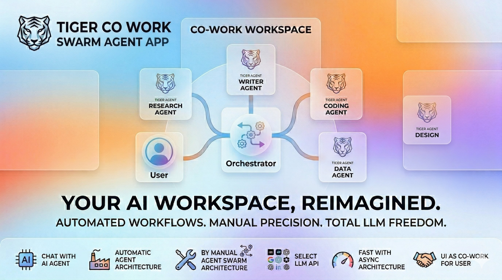

# Tigrimos v0.4.3

A self-hosted AI workspace with chat, code execution, parallel multi-agent orchestration, and a skill marketplace. Mix different AI providers in the same agent team — OpenAI-compatible APIs, Claude Code CLI, and Codex CLI. Connect external MCP servers to extend the AI's toolbox. Built with 16 built-in tools and designed for long-running sessions with smart context compression and checkpoint recovery.

> **Warning:** This app executes AI-generated code and shell commands. Run it inside Docker or a sandboxed environment. See [Security & Docker Setup](docs/TECHNICAL.md#security-notice).

## Screenshots


*AI Chat with tool-calling — generates React/Recharts visualizations rendered in the output panel.*


*Visual Agent Editor — drag-and-drop multi-agent design with mesh networking and YAML export.*


*Minecraft Task Monitor — live pixel-art agents with speech bubbles, walking animations, and inter-agent interactions.*

## Key Features

- **AI Chat with 16 Built-in Tools** — web search, Python, React, shell, files, skills, sub-agents
- **Mix Any Model per Agent** — assign different AI providers per agent (API, Claude Code CLI, Codex CLI)
- **Parallel Multi-Agent System** — 7 orchestration topologies, 4 communication protocols, P2P swarm governance
- **Minecraft Task Monitor** — live pixel-art characters (Steve, Creeper, Enderman, etc.) with speech bubbles showing agent activity, walking animations when agents interact
- **Long-Running Session Stability** — sliding window compression, smart tool result handling, checkpoint recovery
- **MCP Integration** — connect any Model Context Protocol server (Stdio, SSE, StreamableHTTP)
- **Output Panel** — renders React components, charts, HTML, PDF, Word, Excel, images, and Markdown
- **Skills & ClawHub** — install AI skills from the marketplace or build your own
- **Projects** — dedicated workspaces with memory, skill selection, and file browser

## Installation

### One-Click Installers

**Mac:**
1. Download [`Tigrimos.zip`](https://github.com/Sompote/tiger_cowork/releases/latest)
2. Unzip, right-click `Tigrimos.app` and select **Open**

**Windows:**
1. Download [`TigrimosInstaller.zip`](https://github.com/Sompote/tiger_cowork/releases/latest)
2. Unzip and run `TigrimosInstaller.bat`

**Prerequisite:** [Docker Desktop](https://www.docker.com/products/docker-desktop/) must be installed and running.

| | Mac | Windows |
|---|---|---|
| **Start** | Double-click `Tigrimos.app` | Double-click `TigrimosStart.bat` |
| **Stop** | Docker Desktop → Containers → Stop | Double-click `TigrimosStop.bat` |

### Terminal Install

**Mac/Linux:**
```bash
curl -fsSL https://raw.githubusercontent.com/Sompote/tiger_cowork/main/install.sh | bash
```

**Windows (PowerShell):**
```powershell
irm https://raw.githubusercontent.com/Sompote/tiger_cowork/main/install.ps1 | iex
```

### Manual Install

**Prerequisites:** Node.js >= 18, npm, Python 3 (optional)

```bash
git clone https://github.com/Sompote/tiger_cowork.git
cd tiger_cowork
bash setup.sh        # installs deps, prompts for ClawHub token
npm run dev          # development → http://localhost:3001
```

**Production:**
```bash
npm run build && npm start
```

## Quick Start

1. Open `http://localhost:3001`
2. Go to **Settings** → enter your API Key, API URL, and Model
3. Click **Test Connection** to verify
4. Start chatting — the AI can search the web, run code, generate charts, and more

## Documentation

| Document | Description |
|---|---|
| [Technical Documentation](docs/TECHNICAL.md) | Architecture, agent system, communication protocols, orchestration topologies, MCP setup, CLI agents, API endpoints, configuration |
| [Changelog](docs/CHANGELOG.md) | Full version history and release notes |

## License

This project is licensed under the [MIT License](LICENSE).
