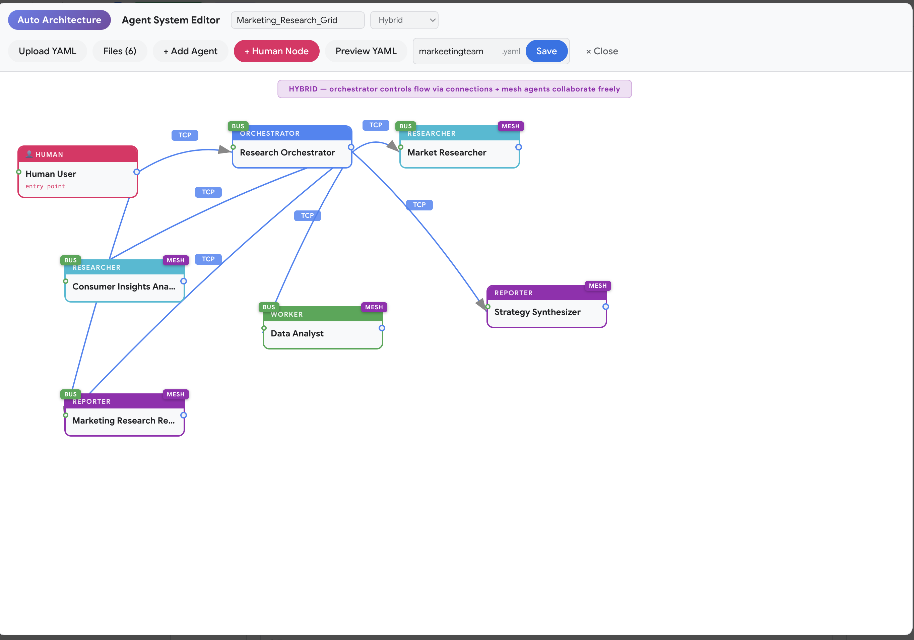

# Tiger Cowork v0.4.2

A self-hosted AI workspace that brings chat, code execution, **fully parallel multi-agent orchestration**, project management, and a skill marketplace into one web interface. **Mix different AI providers in the same agent team** — assign any OpenAI-compatible API model (OpenRouter, Ollama, Gemini, GPT, etc.) to one agent, **Claude Code CLI** (OAuth) to another, and **Codex CLI** (OAuth) to a third. Each agent in your architecture can run on a different model or provider. **Connect external MCP servers** (Stdio, SSE, StreamableHTTP) to extend the AI's toolbox with any Model Context Protocol-compatible service. Built with 16 built-in tools — from web search and Python execution to visual multi-agent systems with mesh networking. Built for **long-running sessions** — smart context compression, checkpoint recovery, and intelligent tool result handling keep conversations stable across 100+ tool calls.

> **Warning:** This app executes AI-generated code and shell commands. Run it inside Docker or a sandboxed environment. See [Security & Docker Setup](docs/TECHNICAL.md#security-notice).

## Screenshots


*AI Chat with tool-calling — reads data, generates React/Recharts visualizations, renders them in the output panel.*


*Visual Agent Editor — drag-and-drop multi-agent design with mesh networking, bus communication, and YAML export.*


*Skills marketplace — install and manage skills from built-in catalog, OpenClaw, and ClawHub community.*

## Demo

[](https://youtu.be/1Ke2dxha1og)

*Auto-generate a complete multi-agent architecture from a natural language description — watch the AI build agent teams with roles, connections, and protocols.*



*Auto-generated agent architecture — AI creates a complete multi-agent system with roles, connections, and communication protocols from a single prompt.*

## What's New in v0.4.2 — MiniMax Built-in Provider

- **MiniMax as built-in AI provider** — MiniMax is now available as a default provider in the Settings dropdown (URL: api.minimax.io/v1, Model: MiniMax-M2.7). No need to manually add it as a custom provider.

### Previous: v0.4.1 — Per-Agent Model Selection & CLI Agent Backends

- **Per-agent model & provider selection** — Each agent in your architecture can run on a different model or backend. In the Agent Editor, check **"Specify model for this agent"** and pick any model — API-based or local CLI. One agent can use GPT-4o via API, another Claude Code via OAuth, and a third Codex CLI — all working together in the same multi-agent system.
- **Claude Code & Codex as code agents (OAuth)** — Set any agent to "Claude Code (Local CLI)" or "Codex (Local CLI)". These run as fully autonomous coding agents with their own tool loops — reading files, editing code, running commands. No API key needed — they authenticate via OAuth (Claude Pro/Max/Team subscription or ChatGPT Plus/Pro plan).
- **Agent waiting/done states** — Task monitor now shows running, waiting, and done agents with distinct visual states and icons.
- **Anti-abandonment nudges** — Prevents the LLM from stopping while sub-agents are still working or when responses sound incomplete.
- **Python auto-retry** — Automatically fixes common syntax errors (unclosed brackets, unterminated strings, Python 2 print statements) and retries.
- **Max context tokens setting** — Configure the token threshold for auto-compaction in Settings.

### Previous: v0.4.0 — Full Parallel Agent Execution

- **True parallel agents** — Multiple agents now work simultaneously instead of one-at-a-time. `wait_result` calls execute in parallel via `Promise.all`, so the orchestrator waits for all agents at once instead of sequentially.
- **Parallel task support** — Send multiple chat messages while agents are working. Per-task context isolation prevents concurrent tasks from corrupting each other's state.
- **Direct orchestrator bypass** — When a realtime agent config has an orchestrator role, user messages route directly to it via bus — skipping the redundant main LLM call entirely. Saves one API call per message.
- **Live task monitor** — Color-coded agent activity with 8 distinct colors, animated working indicators, per-agent tool call counts, and 2-second live refresh. Task page links directly to the associated chat session.

## Key Features

- **AI Chat with Tools** — 16 built-in tools (web search, Python, React, shell, files, skills, sub-agents) with real-time streaming
- **Mix Any Model per Agent** — Each agent in your architecture can use a different AI provider or model. Assign OpenAI-compatible API models (GPT, Gemini, Claude API, LLaMA via Ollama, etc.) to some agents, and use **Claude Code** or **Codex CLI** (OAuth, no API key) as autonomous coding agents for others — all in the same team
- **Parallel Multi-Agent System** — Visual editor for designing agent teams. Three modes: Auto, Spawn Agent, and Realtime. All agents work in parallel with per-task context isolation. Supports mesh networking, bus communication, TCP/Queue protocols, and hybrid orchestration
- **Long-Running Session Stability** — Three layers of protection for extended conversations:
  - **Sliding Window Compression** — Periodically compresses older messages into concise summaries via LLM, preserving key decisions and findings while freeing context space
  - **Smart Tool Result Compression** — Intelligently compresses tool outputs by type (first/last lines for code output, titles+URLs for search, structure preview for fetched pages) instead of raw truncation
  - **Checkpoint & Resume** — Automatically saves session state every N rounds; recovers from crashes or aborts without losing progress
- **Direct Orchestrator Bypass** — In realtime mode with a hierarchical agent config, user messages skip the main LLM and go directly to the orchestrator agent — eliminating redundant API calls
- **Live Task Monitor** — Real-time dashboard showing all active agents with distinct colors, tool call breakdowns, parallel execution indicators, and one-click navigation to the chat session
- **Projects** — Dedicated workspaces with memory, skill selection, file browser, and sandboxed or external working folders
- **Reflection Loop** — Optional self-evaluation that scores and retries incomplete work
- **Output Panel** — Renders React components, charts, HTML, PDF, Word, Excel, images, and Markdown inline
- **Skills & ClawHub** — Install and manage AI skills from the marketplace or build your own
- **MCP Integration** — Connect any Model Context Protocol server to give the AI access to external tools and data sources. Supports **Stdio** (local CLI tools), **SSE** (Server-Sent Events), and **StreamableHTTP** transports. Configure in Settings with auto-discovery — connected tools appear alongside built-in tools automatically
- **Scheduled Tasks** — Cron-based jobs with presets and a management UI

## Installation

### One-Click Installers (No coding required)

**Mac:**
1. Download [`TigerCowork.zip`](https://github.com/Sompote/tiger_cowork/releases/latest)
2. Unzip, right-click `TigerCowork.app` and select **Open** — it installs Docker, downloads the app, builds, and opens `http://localhost:3001`

**Windows:**
1. Download [`TigerCoworkInstaller.zip`](https://github.com/Sompote/tiger_cowork/releases/latest)
2. Unzip and run `TigerCoworkInstaller.bat` — it installs Docker, downloads the app, builds, and opens `http://localhost:3001`

**Prerequisite:** [Docker Desktop](https://www.docker.com/products/docker-desktop/) must be installed and running.

| | Mac | Windows |
|---|---|---|
| **Start** | Double-click `TigerCowork.app` in install folder | Double-click `TigerCoworkStart.bat` |
| **Stop** | Docker Desktop → Containers → Stop | Double-click `TigerCoworkStop.bat` |
| **Set token** | Edit `.env` → `ACCESS_TOKEN=your-token` | Edit `.env` → `ACCESS_TOKEN=your-token` |

### Terminal Install

**Mac/Linux:**
```bash
curl -fsSL https://raw.githubusercontent.com/Sompote/tiger_cowork/main/install.sh | bash
```

**Windows (PowerShell):**
```powershell
irm https://raw.githubusercontent.com/Sompote/tiger_cowork/main/install.ps1 | iex
```

### Manual Install

**Prerequisites:** Node.js >= 18, npm, Python 3 (optional)

```bash
git clone https://github.com/Sompote/tiger_cowork.git
cd tiger_cowork
bash setup.sh        # installs deps, prompts for ClawHub token

# Optional: protect with access token
cp .env.example .env
# Edit .env → ACCESS_TOKEN=your-secret-token

npm run dev          # development → http://localhost:3001
```

**Production:**
```bash
npm run build && npm start
# Or with PM2:
npm run build && pm2 start npm --name "cowork" -- start
```

## Quick Start

1. Open `http://localhost:3001`
2. Go to **Settings** → enter your API Key, API URL, and Model
3. Click **Test Connection** to verify
4. Start chatting — the AI can search the web, run code, generate charts, and more

## Local CLI Agent Setup (Optional)

Use **Claude Code** or **Codex** as autonomous agent backends — they handle code reading, editing, and execution with their own tool loops. No API key needed.

### Claude Code

```bash
# Install
npm install -g @anthropic-ai/claude-code

# Login (one-time — opens browser for OAuth)
claude
# Requires claude.ai Pro, Max, or Team subscription

# Verify
claude -p "hello" --output-format json
```

### OpenAI Codex

```bash
# Install
npm install -g @openai/codex

# Login (one-time — opens browser for OAuth)
codex login
# Requires ChatGPT Plus, Pro, Business, or Enterprise plan
# Alternative: set CODEX_API_KEY environment variable

# Verify
codex exec "hello"
```

### Use in Tiger Cowork

1. Open the **Agent Editor**
2. Select an agent → check **"Specify model for this agent"**
3. Choose a model from the dropdown:
   - **Claude Code (Local CLI)** — autonomous coding agent via OAuth (no API key)
   - **Codex (Local CLI)** — autonomous coding agent via OAuth (no API key)
   - **Any API model** — GPT-4o, Gemini, Claude API, LLaMA, etc. (uses your configured API)
4. Save — each agent runs on its assigned backend

**Example: Mixed-provider architecture**

| Agent | Role | Model/Backend |
|---|---|---|
| Research Orchestrator | orchestrator | GPT-5.4 Pro (API) |
| Literature Researcher | researcher | Gemini Flash (API) |
| Simulation Engineer | worker | Claude Code (OAuth CLI) |
| Code Optimizer | worker | Codex (OAuth CLI) |
| Quality Checker | checker | Claude Code (OAuth CLI) |
| Report Creator | reporter | Claude Opus (API) |

All agents work in parallel, communicating via mesh/bus/TCP — regardless of which provider powers each one.

### Headless Server (no browser)

If the server has no browser for OAuth login, authenticate on another machine first, then copy the credentials:

```bash
# Claude Code
scp -r ~/.claude user@server:~/.claude

# Codex
scp -r ~/.codex user@server:~/.codex
```

## MCP Server Setup (Optional)

Connect external **Model Context Protocol** servers to extend the AI's toolbox with third-party tools and data sources. MCP tools become available to all agents automatically.

### Supported Transports

| Transport | Use Case | Example |
|---|---|---|
| **StreamableHTTP** | Cloud-hosted MCP services | `https://api.example.com/mcp` |
| **SSE** | Server-Sent Events endpoints | `https://mcp.example.com/sse` |
| **Stdio** | Local CLI tools / executables | `npx @modelcontextprotocol/server-filesystem /path` |

### Configure in Settings

1. Go to **Settings** → scroll to **MCP Servers**
2. Add server configuration as JSON:

```json
{
  "mcpServers": {
    "web-search": {
      "type": "http",
      "url": "https://api.example.com/mcp",
      "headers": { "Authorization": "Bearer your-token" },
      "enabled": true
    },
    "local-files": {
      "type": "stdio",
      "command": "npx",
      "args": ["-y", "@modelcontextprotocol/server-filesystem", "/path/to/folder"],
      "enabled": true
    }
  }
}
```

3. Click **Save & Connect All**
4. Connected tools appear with a green status dot and tool count

Once connected, MCP tools are automatically available to the AI alongside the 16 built-in tools. Tool names follow the pattern `mcp_{serverName}_{toolName}` — the AI can call them like any other tool.

## Context Management Settings

These settings control how Tiger Cowork handles long conversations. Configure them in **Settings** or directly in `data/settings.json`.

| Setting | Default | Description |
|---|---|---|
| `agentCompressionInterval` | `5` | Compress older messages every N tool loop rounds |
| `agentCompressionWindowSize` | `10` | Number of recent messages to keep uncompressed |
| `agentCompressionModel` | *(main model)* | Optional cheaper/faster model for compression (e.g., `meta-llama/llama-3.1-8b-instruct`) |
| `agentCheckpointEnabled` | `true` | Enable automatic checkpoint saving for crash recovery |
| `agentCheckpointInterval` | `5` | Save checkpoint every N rounds |
| `agentToolResultMaxLen` | `6000` | Max chars per tool result (hard-capped at 100KB) |
| `agentMaxToolRounds` | `8` | Max iterations of the tool-calling loop |
| `agentMaxToolCalls` | `12` | Total tool calls allowed per session |

**Recommended for large-context models (Grok, Gemini 2M):**
```json
{
  "agentMaxToolRounds": 30,
  "agentMaxToolCalls": 50,
  "agentToolResultMaxLen": 50000,
  "agentCompressionInterval": 5,
  "agentCheckpointInterval": 5
}
```

## Documentation

| Document | Description |
|---|---|
| [Technical Documentation](docs/TECHNICAL.md) | Architecture, agent system details, sub-agent modes, reflection loop, all features, API endpoints, Socket.IO events, project structure, Docker setup, configuration |
| [Changelog](docs/CHANGELOG.md) | Full version history and release notes |

## License

This project is licensed under the [MIT License](LICENSE).
