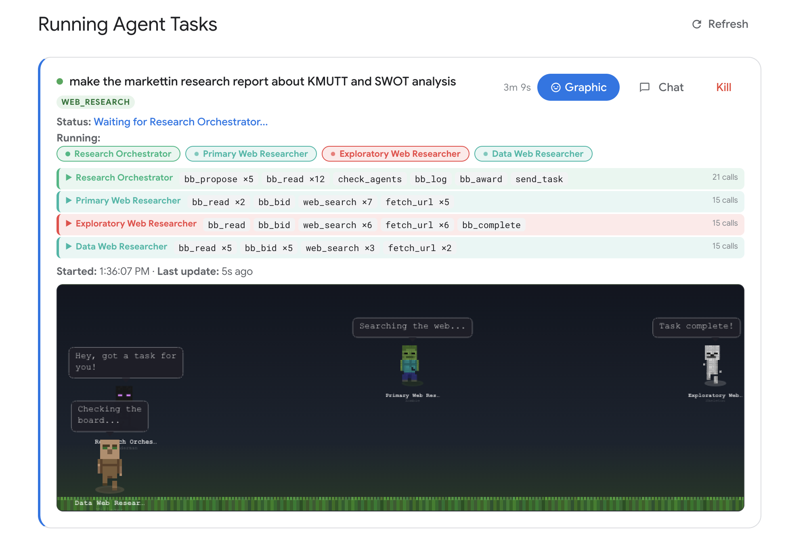

# Tiger CoWork v0.5.0

A self-hosted AI workspace with chat, code execution, parallel multi-agent orchestration, cross-machine agent connection, and a skill marketplace. Mix different AI providers in the same agent team — OpenAI-compatible APIs, Claude Code CLI, and Codex CLI. Connect agents across machines on your network so distributed teams can collaborate in real time. Connect external MCP servers to extend the AI's toolbox. Built with 16 built-in tools and designed for long-running sessions with smart context compression and checkpoint recovery.

> **Warning:** This app executes AI-generated code and shell commands. Run it inside Docker or a sandboxed environment. See [Security & Docker Setup](docs/TECHNICAL.md#security-notice).

## Screenshots


*AI Chat with tool-calling — generates React/Recharts visualizations rendered in the output panel.*


*Visual Agent Editor — drag-and-drop multi-agent design with mesh networking and YAML export.*



*Minecraft Task Monitor — live pixel-art agents with speech bubbles, walking animations, and inter-agent interactions.*

## Key Features

- **AI Chat with 16 Built-in Tools** — web search, Python, React, shell, files, skills, sub-agents
- **Mix Any Model per Agent** — assign different AI providers per agent (API, Claude Code CLI, Codex CLI)
- **Parallel Multi-Agent System** — 7 orchestration topologies, 4 communication protocols, P2P swarm governance
- **Cross-Machine Agent Connection** — connect agents running on different machines over the network, enabling distributed multi-agent collaboration across your infrastructure
- **Minecraft Task Monitor** — live pixel-art characters (Steve, Creeper, Enderman, etc.) with speech bubbles showing agent activity, walking animations when agents interact
- **Long-Running Session Stability** — sliding window compression, smart tool result handling, checkpoint recovery
- **MCP Integration** — connect any Model Context Protocol server (Stdio, SSE, StreamableHTTP)
- **Output Panel** — renders React components, charts, HTML, PDF, Word, Excel, images, and Markdown
- **Skills & ClawHub** — install AI skills from the marketplace or build your own
- **Projects** — dedicated workspaces with memory, skill selection, and file browser

## Installation

### One-Click Installers

**Mac:**
1. Download [`TigerCoWork.zip`](https://github.com/Sompote/tiger_cowork/releases/latest)
2. Unzip, right-click `TigerCoWork.app` and select **Open**

**Windows:**
1. Download [`TigerCoWorkInstaller.zip`](https://github.com/Sompote/tiger_cowork/releases/latest)
2. Unzip and run `TigerCoWorkInstaller.bat`

**Prerequisite:** [Docker Desktop](https://www.docker.com/products/docker-desktop/) must be installed and running.

| | Mac | Windows |
|---|---|---|
| **Start** | Double-click `TigerCoWork.app` | Double-click `TigerCoWorkStart.bat` |
| **Stop** | Docker Desktop → Containers → Stop | Double-click `TigerCoWorkStop.bat` |

### Terminal Install

**Mac/Linux:**
```bash
curl -fsSL https://raw.githubusercontent.com/Sompote/tiger_cowork/main/install.sh | bash
```

**Windows (PowerShell):**
```powershell
irm https://raw.githubusercontent.com/Sompote/tiger_cowork/main/install.ps1 | iex
```

### Manual Install

Log in to your Linux server directly or via SSH:
```bash
ssh root@<your-server-ip>
```

> **⚠️ Security Warning:** AI agents can execute arbitrary code and shell commands that may modify or delete files on the host system. It is strongly recommended to run Tiger CoWork on a **VPS or dedicated machine that contains no important data**. Do not run it on a machine with sensitive or irreplaceable information.

**Prerequisites:** Node.js >= 18, npm, Python 3 (optional)

```bash
git clone https://github.com/Sompote/tiger_cowork.git
cd tiger_cowork
bash setup.sh        # installs deps, prompts for ClawHub token
npm run build && npm start   # → http://localhost:3001
```

> **Running in background (recommended):** Use [PM2](https://pm2.keymetrics.io/) to keep Tiger CoWork running after you close the terminal.
>
> ```bash
> npm install -g pm2          # install PM2 globally
> npm run build               # build production bundle
> pm2 start npm --name "tiger-cowork" -- start   # start in background
> pm2 save                    # save process list for auto-restart
> pm2 startup                 # enable auto-start on system boot
> ```
>
> Useful PM2 commands:
> ```bash
> pm2 status                  # check running processes
> pm2 logs tiger-cowork       # view logs
> pm2 restart tiger-cowork    # restart
> pm2 stop tiger-cowork       # stop
> ```

## Quick Start

1. Open `http://localhost:3001`
2. Go to **Settings** → enter your API Key, API URL, and Model
3. Click **Test Connection** to verify
4. Start chatting — the AI can search the web, run code, generate charts, and more

## Documentation

| Document | Description |
|---|---|
| [Technical Documentation](docs/TECHNICAL.md) | Architecture, agent system, communication protocols, orchestration topologies, MCP setup, CLI agents, API endpoints, configuration |
| [Changelog](docs/CHANGELOG.md) | Full version history and release notes |

## License

This project is licensed under the [MIT License](LICENSE).
